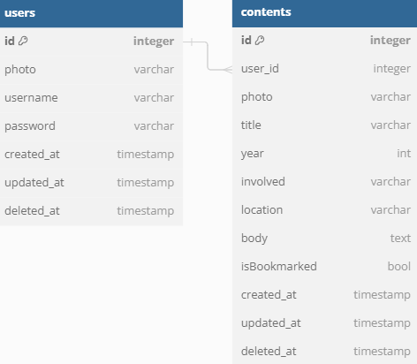

# Historian App

Simple App CRUD App using Flutter and Fiber (Go)

## Tech-Stack

* Flutter: Mobile App UI
* Fiber: Golang Framework
* MySQL: Relational Database
* JWT: Authentication

## DB Diagram

